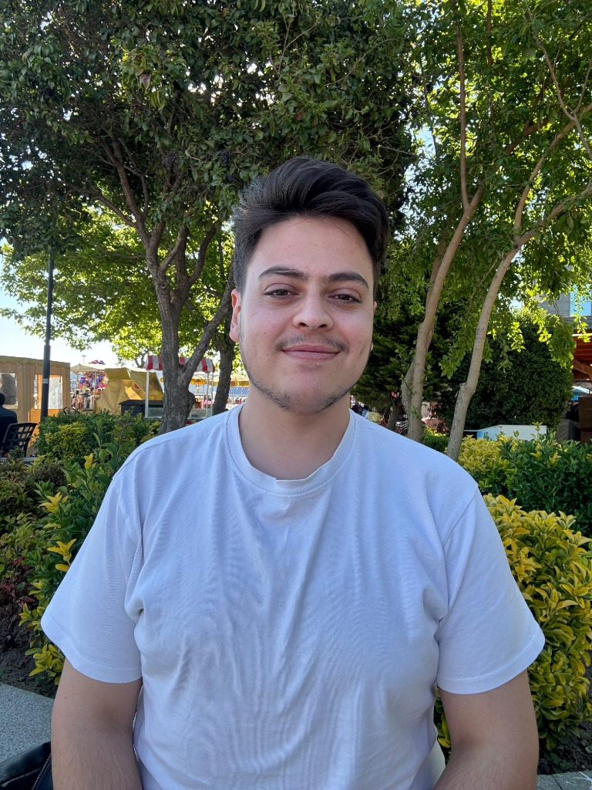

# Mehmet Sayman - Personal Portfolio

 <!-- Update this with an actual screenshot if available -->

Welcome to the repository for my personal portfolio website! This project is a modern, responsive, and highly interactive web application designed to showcase my skills, projects, and passion for Software Development and Artificial Intelligence.

## 🚀 Live Demo

*(Add your GitHub Pages or Vercel link here once deployed. Example: `https://mehmetsayman.github.io/Mehmet-Sayman`)*

## 💡 About The Project

As a 3rd-year Computer Engineering student at Çanakkale Onsekiz Mart University (ÇOMÜ), I built this portfolio to highlight my capabilities and stand out in summer internship applications. The design focuses on a **dark tech theme** characterized by glassmorphism, glowing accents, and smooth animations, reflecting my interest in modern system architecture and AI.

### Key Features
- **Hero Section:** Engaging introduction with a dynamic, morphing profile picture and floating tech badges.
- **Glassmorphism UI:** Sophisticated translucent cards that provide a premium visual experience.
- **Animated Skills Bar:** Visual representation of my proficiency in Python, Java, C#, C++, and C.
- **Interactive Project Grid:** A sleek display for highlighting my top projects out of the 50+ I've developed, complete with hover effects and direct GitHub links.
- **Responsive Layout:** Flawless experience across desktop, tablet, and mobile devices.

## 🛠️ Built With

This project relies purely on modern web standards without heavy frameworks, ensuring maximum performance and customizability:
- **HTML5:** Semantic and accessible structure.
- **Vanilla CSS3:** Advanced styling leveraging CSS Variables, Flexbox, Grid, and complex animations.
- **Vanilla JavaScript:** DOM manipulation for scroll reveals, mobile navigation, and dynamic UI elements.
- **Phosphor Icons:** Clean and modern iconography.
- **Google Fonts:** Utilizing 'Inter' and 'Outfit' for professional typography.

## 📂 Project Structure

```text
├── css/
│   └── style.css       # Core styling, responsive design, animations
├── images/
│   └── profile.jpg     # Profile and asset images
├── js/
│   └── script.js       # Interactivity (scroll effects, mobile menu)
├── index.html          # Main HTML document
└── README.md           # Project documentation
```

## 💻 Running Locally

To view this project on your local machine, simply clone the repository and open the `index.html` file in your browser:

1. Clone the repository:
   ```bash
   git clone https://github.com/mehmetsayman/Mehmet-Sayman.git
   ```
2. Navigate to the project directory:
   ```bash
   cd Mehmet-Sayman
   ```
3. Open `index.html` in your preferred web browser.

## 📫 Contact & Links

Feel free to reach out for internship opportunities, collaborations, or just to say hi!

- **Email:** [mehmetsayman1903@gmail.com](mailto:mehmetsayman1903@gmail.com)
- **LinkedIn:** [in/mehmet-sayman-261b86328](https://www.linkedin.com/in/mehmet-sayman-261b86328/)
- **GitHub:** [github.com/mehmetsayman](https://github.com/mehmetsayman)

---
*Designed and Developed by Mehmet Sayman © 2026*